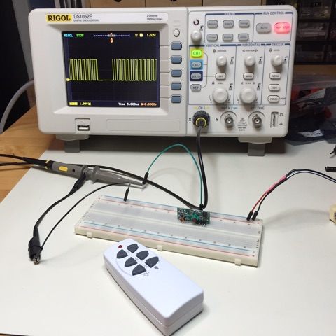

Reverse Engineering the EMW200TA 433 MHz Transmitter
====================================================

This repository documents my work of reverse engineering an [RF transmitter](http://www.clasohlson.com/se/Fjärrströmbrytare-3-pack/Pr363570000) so I can control the receivers with a transmitter I build myself.


Hello World
-----------

Let's see if I can capture data from the above transmitter using an off-the-shelf RF receiver:


Below depicts the simple setup you need to capture a 433 MHz signal using an oscilloscope and the above RF receiver:



Below follows one example of a captured button press:


After saving the data as CSV I used [Jupyter Notebook](http://jupyter.readthedocs.org) to parse and manipulate it. First let's compare the above screenshot with my [Matplotlib](http://matplotlib.org) plot:


Now let's get rid of that noise:


Next step is to convert this stream of highs and lows to something meaningful. I'm ready to capture all button presses and decode the bytes.

Please see the [helloworld notebook](helloworld.ipynb) to enjoy the Python source code for generating the above plots.


Decoding Bit Messages
---------------------

I created a [decoder notebook](decoder.ipynb) to help me understand the captured waveforms, enough to write an algorithm that decodes the individual messages to their pure bits. The algorithm was extracted from the notebook into [decoder.py](decoder.py). The script takes a Rigol CSV as input and prints the decoded bits one line per message:

```
$ python decoder.py data/a1on.csv
010101010101110
0001010100010101010101110
0001010100010101010101110
0001010100010101010101110
0001010100010101010101110
0001010100010101010101110
0001010100010101010101110
00010101000101010101011
```

All button presses of the transmitter were captured and decoded as follows:

```
Button 1 ON:  0001010100010101010101110
Button 1 OFF: 0001010100010101010101000
Button 2 ON:  0001010101000101010101110
Button 2 OFF: 0001010101000101010101000
Button 3 ON:  0001010101010001010101110
Button 3 OFF: 0001010101010001010101000
```

Let's separate the bits a bit (:D) to clarify what's changing in each button press:

```
Button 1 ON:  000101010 00101 01010101 11 0
Button 1 OFF: 000101010 00101 01010101 00 0
Button 2 ON:  000101010 10001 01010101 11 0
Button 2 OFF: 000101010 10001 01010101 00 0
Button 3 ON:  000101010 10100 01010101 11 0
Button 3 OFF: 000101010 10100 01010101 00 0
                        ^              ^
                        button nr      on/off
```


Signal Details
--------------

Before being able to replicate the above messages with my own transmitter I need to figure out the exact timings of the signals. That I did in the [signal_details](signal_details.ipynb) notebook.

Summary:

* `25`-bit messages are sent at an interval of `44 120 ns` (includes a `9 620 ns` pause after the last bit).
* Every bit is sent during `1 380 ns`.
    * A start of `969 ns` high signal represent a digital one.
    * A start of `284 ns` high signal represent a digital zero.
    * The rest of the `1 380 ns` are a low signal.
* All this adds together: `25 * 1 380 + 9 620 = 44 120`.


Create My Own Transmitter
-------------------------

TODO: Next step is to decide which microcontroller I'll use to send the above signals using the off-the-shelf RF transmitter:


Development
-----------

* Install [Anaconda](https://www.continuum.io/downloads) (v2.7.1 was used)
* Open the notebook with `jupyter notebook`


References
----------

* https://fetzerch.github.io/2014/11/15/reveng433/
* http://mightydevices.com/?p=300
* https://www.youtube.com/playlist?list=PLRJx8WOUx5Xd3_dgw5xRmABUd8MWdsA_C
* http://nbviewer.ipython.org/github/twistedhardware/mltutorial/blob/master/notebooks/IPython-Tutorial/
