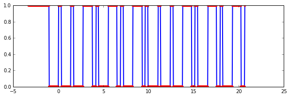

Reverse Engineering the EMW200TA 433 MHz Transmitter
====================================================

This repository documents my work of reverse engineering an RF transmitter so I can control the receivers with a transmitter I build myself.

Hello World
-----------

Let's see if I can capture data from the above transmitter using an off-the-shelf RF receiver:

I successfully captured the signal of pressing one button with my Rigol DS1052E oscilloscope:

After saving the data as CSV I used [Jupyter Notebook](http://jupyter.readthedocs.org) to parse and manipulate it. First let's compare the above screenshot with my [Matplotlib](http://matplotlib.org) plot:

Now let's get rid of that noise:

Next step is to convert this stream of highs and lows to something meaningful. I'm ready to capture all button presses and decode the bytes. See the [HTML version](raw/master/helloworld.html) of the [notebook](helloworld.ipnb) for the source code of generating the above plots.

Decoding Highs and Lows
-----------------------

TODO: figure out a HEX representation of the above binary stream.

The Reverse Engineered Bits
---------------------------

TODO: capture all button presses and document all data the transmitter is sending.

Create My Own Transmitter
-------------------------

TODO: send the above signals using an off-the-shelf RF transmitter:

Development
-----------

* Install [Anaconda](https://www.continuum.io/downloads) (v2.7.1 was used)
* Open the notebook with `jupyter notebook`

References
----------

* https://fetzerch.github.io/2014/11/15/reveng433/
* http://mightydevices.com/?p=300
* https://www.youtube.com/playlist?list=PLRJx8WOUx5Xd3_dgw5xRmABUd8MWdsA_C
* http://nbviewer.ipython.org/github/twistedhardware/mltutorial/blob/master/notebooks/IPython-Tutorial/
